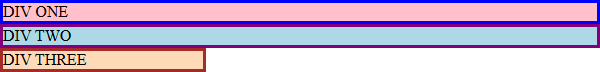
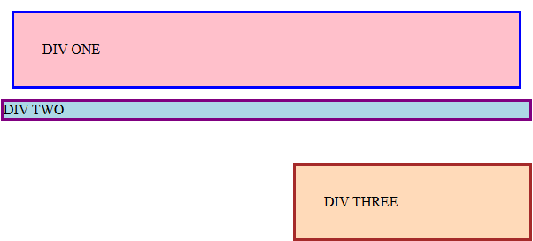
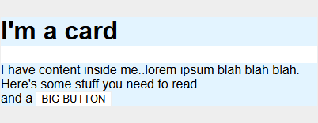
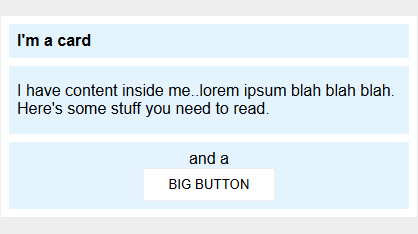
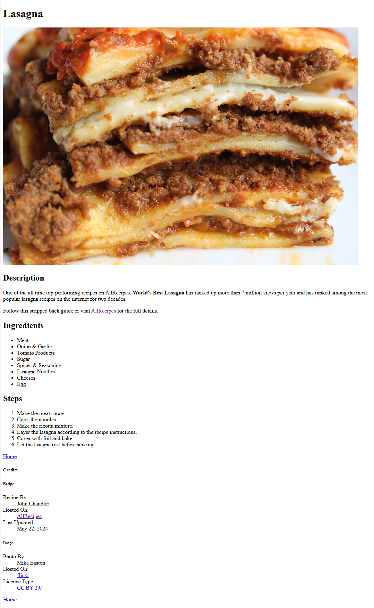

# Block And Inline

Exercises to test understanding of block and inline display types.

- Completed as part of the **CSS Foundations** section of the **Foundation Course** at [TheOdinProject](https://www.theodinproject.com).
- Taken from  the specified **css-exercises** repo; specifically the folder pertaining to [intro-to-css](https://github.com/TheOdinProject/css-exercises/tree/main/foundations/block-and-inline)

---

## Assignment Instructions

 - ### [01 - Margin & Padding 1 &rArr;](./block-and-inline/01-margin-and-padding-1/)
 - ### [02 - Margin & Padding 2 &rArr;](./block-and-inline/02-margin-and-padding-2/)
 - ### [03 - Add CSS Style To Recipe Project &rArr;](./recipe-css/)

## Results

<table>

<tr>
<td width="47%">

### 01 - Margin & Padding 1

</td>
<td width="6%"></td>
<td width="47%"></td>
</tr>

<tr>
<td>

#### BEFORE

</td>
<td></td>
<td>

#### AFTER

</td>
</tr>

<tr>
<td>

</td>
<td align="center">
<h1>&rArr;</h1>
</td>
<td>

</td>
</tr>

<tr>
<td>

### 02 - Margin & Padding 2

</td>
<td></td>
<td></td>
</tr>

<tr>
<td>

#### BEFORE

</td>
<td></td>
<td>

#### AFTER

</td>
</tr>

<tr>
<td>

</td>
<td align="center">
<h1>&rArr;</h1>
</td>
<td>

</td>
</tr>

### 03 - Add CSS Style To Recipe Project

</td>
<td></td>
<td></td>
</tr>

<tr>
<td>

#### BEFORE

</td>
<td></td>
<td>

#### AFTER

</td>
</tr>

<tr>
<td>

</td>
<td align="center">
<h1>&rArr;</h1>
</td>
<td>

*coming soon*

<!--  -->

</td>
</tr>

</table>
